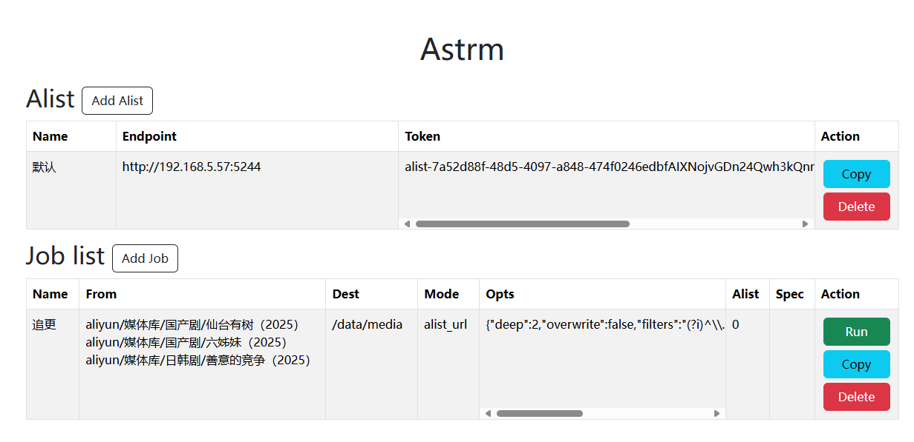
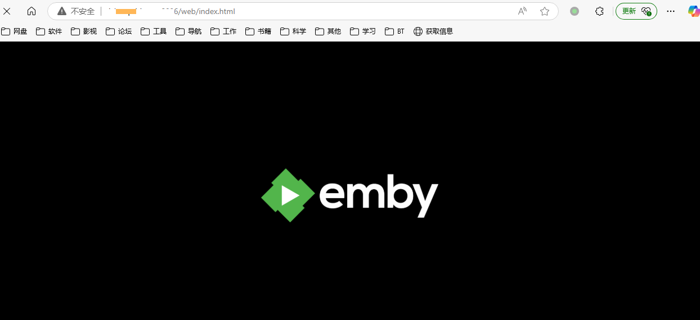

# astrm
`emby` 拓展工具，主要功能如下：
-  手动 / 自动将 `alist` 上的文件转为 `strm` 文件存到本地，方便扫库，降低风控 
-  代理 `emby` 服务器，完成直链 `302` 重定向服务 （不消耗emby服务器带宽）

# 配置文件
```yaml
debug: true # 是否启用 debug 模式，启用了日志比较多
persistence: '@every 10s' # 持久化配置的间隔，会自动将变动的配置存储到本地进行覆盖，可以直接写cron表达式, 具体看 github.com/robfig/cron
listen: :8080 # 监听端口，服务器的端口

alist:
  - name: 默认 # alist 名称
    endpoint: http://host.docker.internal # alist 地址
    token: alist-xxxx # alist 永久 token，在管理页面获取

# strm jobs
jobs:
  - name: 追更  # 任务的名称
    alist: 0 # alist 配置的索引，根据你上面的来
    
    # 从 alist 哪个目录下获取资源，一行一个目录
    from: |- 
      aliyun/媒体库/国产剧/目录1
      aliyun/媒体库/国产剧/目录2
      
    dest: /data/media/国产剧 # 写入到本地什么目录下
    # 模式，可选 alist_url / alist_path / raw_url
    # alist_url 模式下，会自动将 alist 直链写入 strm 文件内, 如果是内网地址，可以使用下面的 httpStrm 配置
    # alist_path 模式下，会自动将 alist 路径写入 strm 文件内，必须使用下面的 alistStrm 配置
    # raw_url 模式下，会自动将原始网盘直链写入 strm 文件内，网盘可能有时效性，可能会过期
    mode: alist_url 
    spec: ""  # 调度规则，不写表示不定时调度，可以写crontab 表达式, 具体看 github.com/robfig/cron
    opts:
      # 目录深度，
      # 例如当 deep 为1的时候
      # from 为 a/b/c 
      # dest 为 /data/media/a/b
      # a/b/c 下存在 1和2两个视频文件
      # 则生成的目录结构为 /data/media/a/b/c/1.strm, /data/media/a/b/c/2.strm

      # 例如当 deep 为 0 的时候
      # from 为 a/b/c 
      # dest 为 /data/media/a/b
      # a/b/c 下存在 1和2两个视频文件
      # 则生成的目录结构为 /data/media/a/b/1.strm, /data/media/a/b/2.strm
      deep: 1 
      
      # 是否重新覆盖已经生成了的文件
      overwrite: true
      # 过滤器，正则表达式，不写表示使用默认的视频格式
      filters: (?i)^\.(mp4|avi|mkv|mov|webm|flv|wmv|3gp|mpeg|mpg)$
      # 额外需要下载的文件过滤器，正则表达式，咱不支持（后面可能支持下载字幕/封面等）
      extra: ""

# 需要代理的 emby 配置
emby:
  addr: http://youremby.com # emby服务端
  apiKey: xxx # emby 的 apiKey
  
  # http 类型的 strm 文件302方案，也就是strm文件内容是http://xx 这类的链接
  httpStrm:
    - enable: true # 开关
      match: /data/media # strm 文件本地存储路径的正则，满足则会出发302方案
      # 触发之后的操作
      actions:
        - type: replace # 替换模式
          args: host.docker.internal -> youremby.com # 将url 里面的host.docker.internal替换为youremby.com
      transCode: false # 是否开启转码
  
  # alist path 类型的 strm 文件302方案，也就是strm文件内容是 alist 的路径, 类似 /aliyun/xxx
  alistStrm:
    - enable: true # 开关
      match: /data/media # strm 文件本地存储路径的正则，满足则会出发302方案
        # 触发之后的操作
      actions:
        - type: replace # 替换模式
          args: host.docker.internal -> youremby.com # 将url 里面的host.docker.internal替换为youremby.com
      transCode: false # 是否开启转码
      rawURL: false # 是否直接重定向到 rawUrl，也就是网盘的直链
      alist: 0 # 对应的 alist 服务器编号，会访问这个 alist 将alist path 转为直链

log:
  level: 4 # 日志等级，1-5，1为debug，5为error
  path: logs/app.log # 日志文件路径

# strm 管理入口，记得修改，不然谁都可以进去，如当该值为 enter的时候，管理页面的地址就是 http://host:port/admin/enter
entrance: "enter" 


```

# `alist` 管理页面
访问地址：` http://host:port/admin/{你的 entrance 配置}`

- `Copy`：复制并新建配置
- `Delete`：删除配置
- `Run`：主动触发任务
- `Add Alist`：新增一项 `alist` 配置
- `Add Job`：新增一项任务配置

**双击单元格可以修改单元格内容**

# `emby` 服务
访问地址：`http://host:port/` 即可访问你的 `emby` 服务，emby服务可以部署在内网，只要 `astrm` 服务可以正常访问到即可
